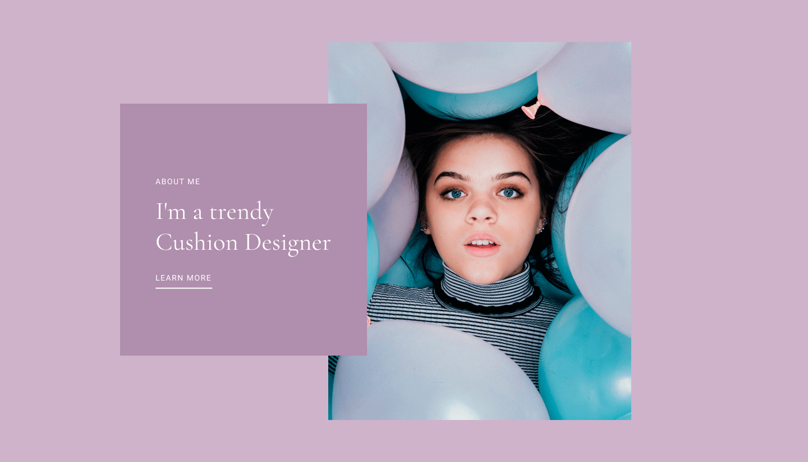
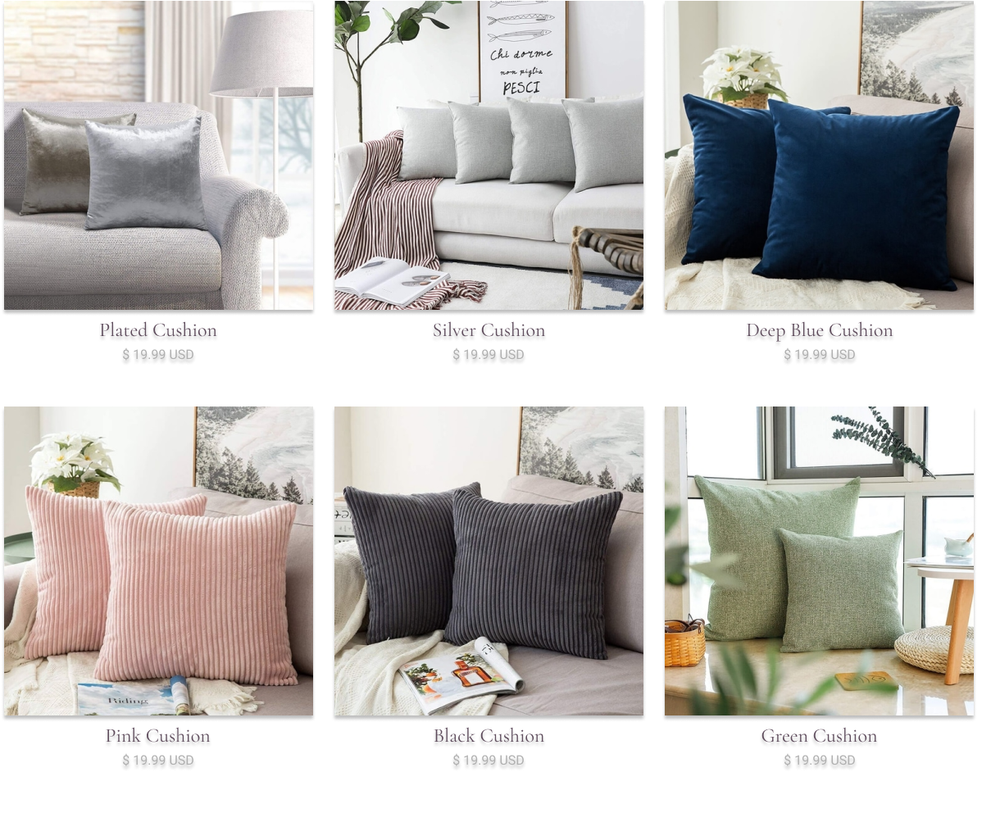
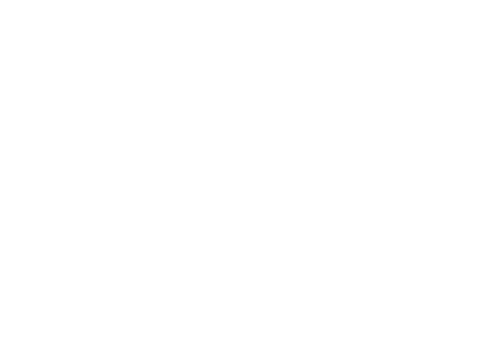

# Задание 1
```
.head
.head__hair .head__hair_length_long
.head__eyes .head__eyes_color_green
.head__nose .head__nose_type_mid

.body
.body__skin .body__skin_color_white
.body__chest .body__chest_type_inflated
.body__arms .body__arms_length_short

.legs
.legs__calves .legs__calves_size_big
.legs__foots .legs__foots_shapes_egyptian
```
## Задание 2


```
header.header>div.container>nav.nav>ul.nav__list>a.nav__logo-link>img^li.nav__item*4>a.nav__link^a.nav__basket-link
```


```
section.banner-section>div.container>img+div.banner__info>p.banner__category+h2.banner_title+a.banner-link
```

```
section.cards-section>div.container>ul.cards__list>li.card__item*6>img+p.card__title+p.card__price
```


```
section.form-section>div.container>ul.form__info_column>li.info__item*3>p.info__title+p.info__subtitle^^form.form>fieldset.contact__form>legend>p.form__title+p.form__subtitle^^div.form__container>div.input__container*5>input.form__text-input+label.visuallyhidden^button.submit
```